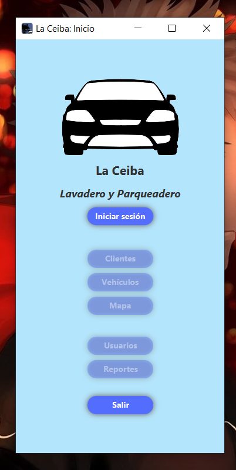
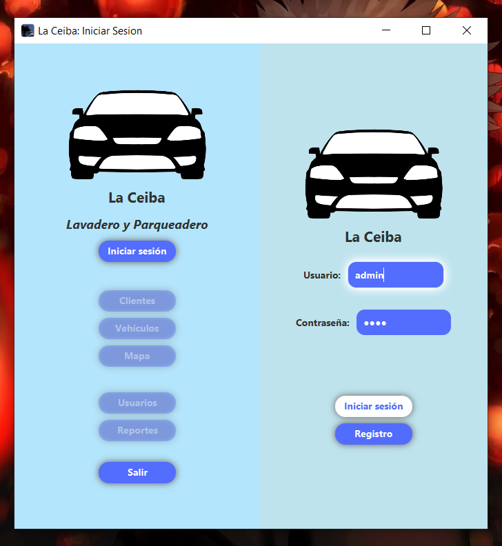
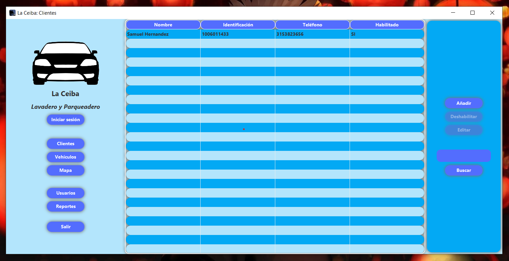
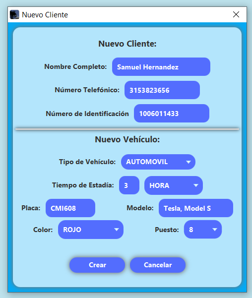
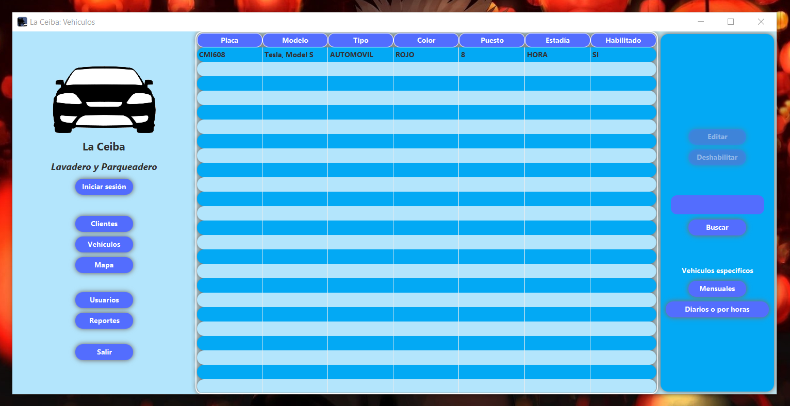
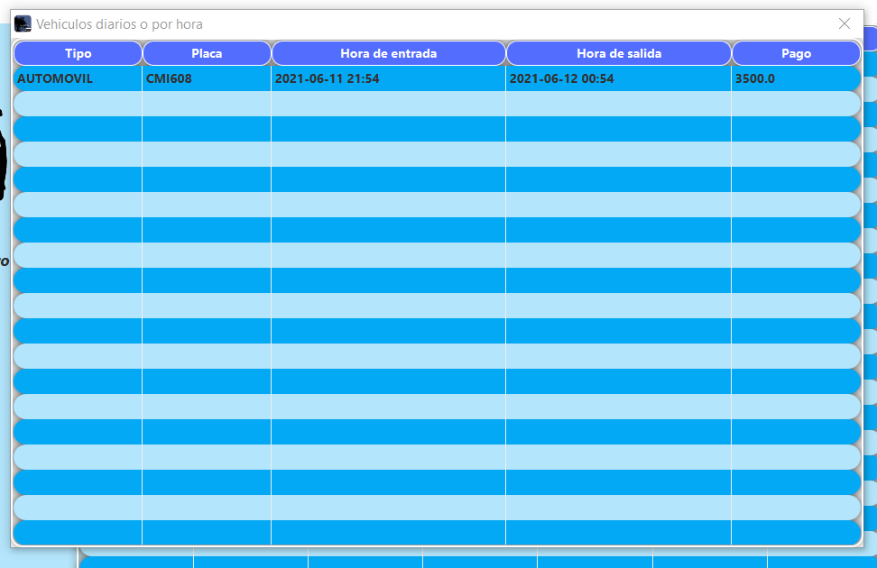
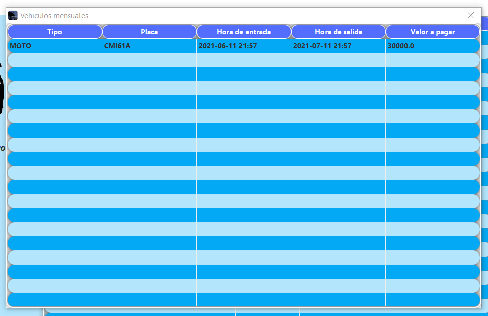
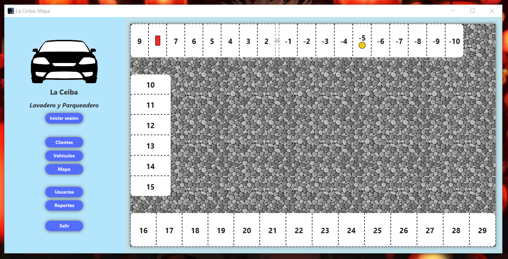
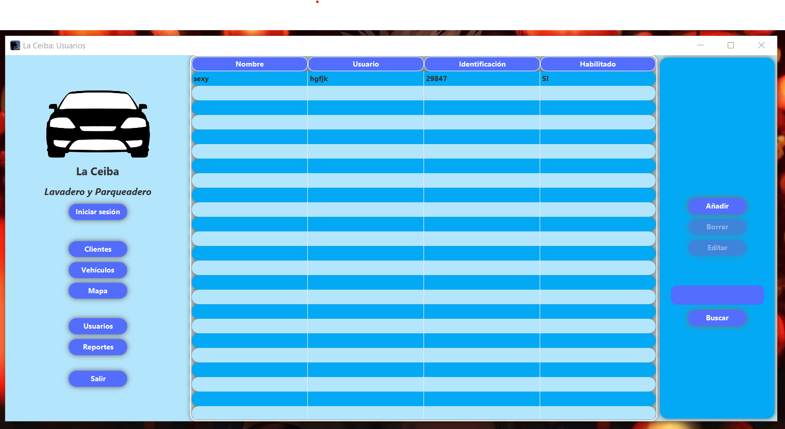
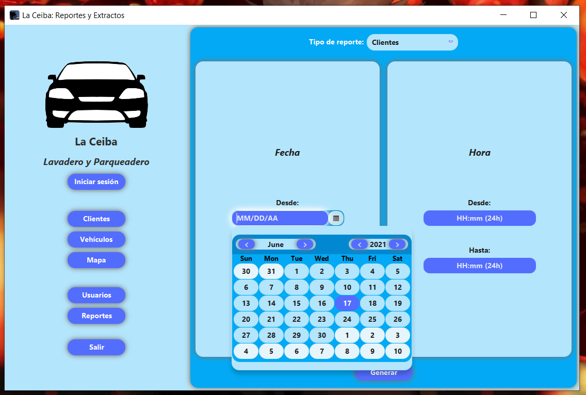

# README: <i>La Ceiba</i> Parking Lot

---
Made by [@1KVueltasAlCampo](https://github.com/1KVueltasAlCampo), [@Juanperezaa](https://github.com/Juanperezaa) and [@zacwastaken](https://github.com/zacwastaken)

<i>This document is part of a Git repository. If you found it elsewhere on the internet, please refer
to [this GitHub repository](https://github.com/zacwastaken/la-ceiba-parking-lot) for the full project.</i>

---

## About

This is a Java app for managing the clients, parking spaces and income of <i>La Ceiba</i> parking
lot. The program was created in order to satisfy the need of the manager of the La Ceiba parking lot to organize and virtualize the registration of activities.

## Technical conditions
#### Programming language:
Java
#### Operating system:
Windows
#### Development environment:
Intellij IDEA and Eclipse IDE

### [File for Milestone1](docs/FirstDelivery.pdf)
### [Design of the test cases](https://docs.google.com/document/d/1rJG2B4wJkk-KD5t1A2mdccVYT4sfvYLXXF2zAyB9Ff8/edit?usp=sharing)
### [File for Milestone2](docs/2ndMilestone.pdf)
### [Class Diagram Milestone2](docs/ClassDiagram.pdf)
### [Functional Requirements](docs/RequerimientosFuncionalesTI3.pdf)

---

## Screenshots 

---

## Showcase of the program (Spanish)

//YouTube video link here//
