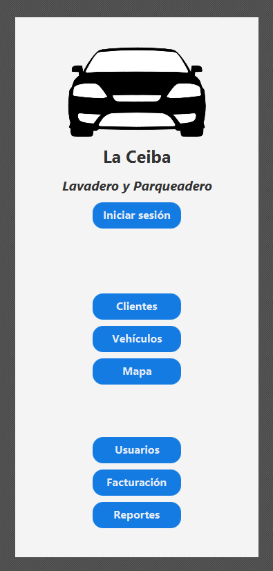
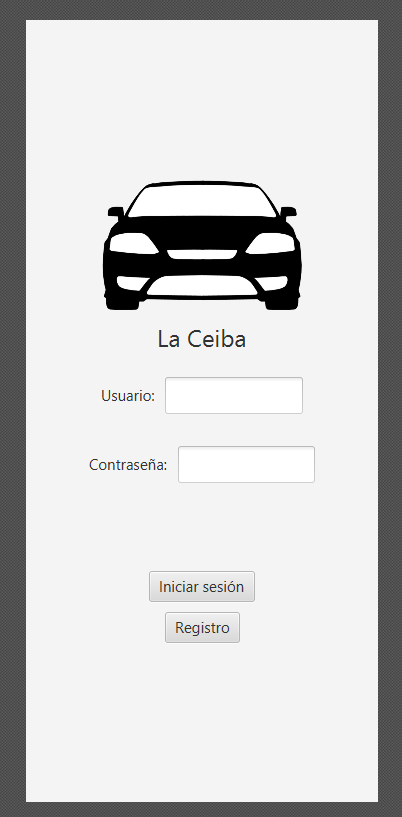
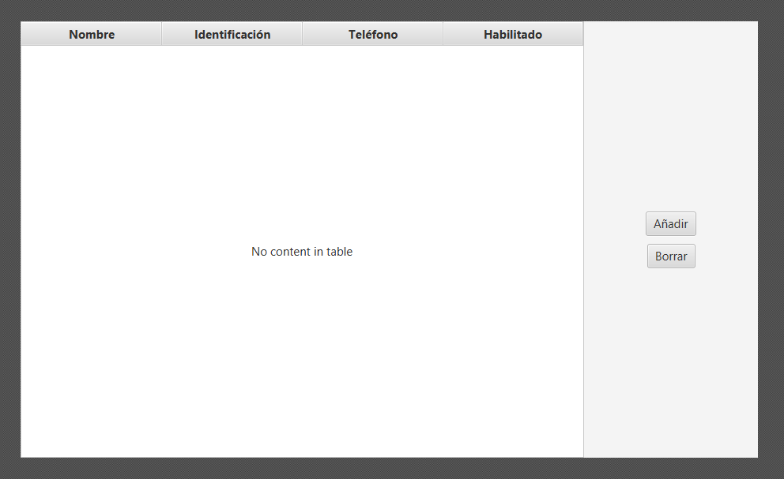
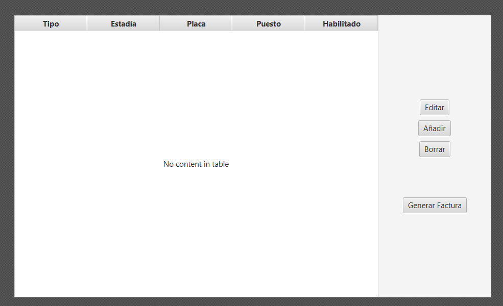
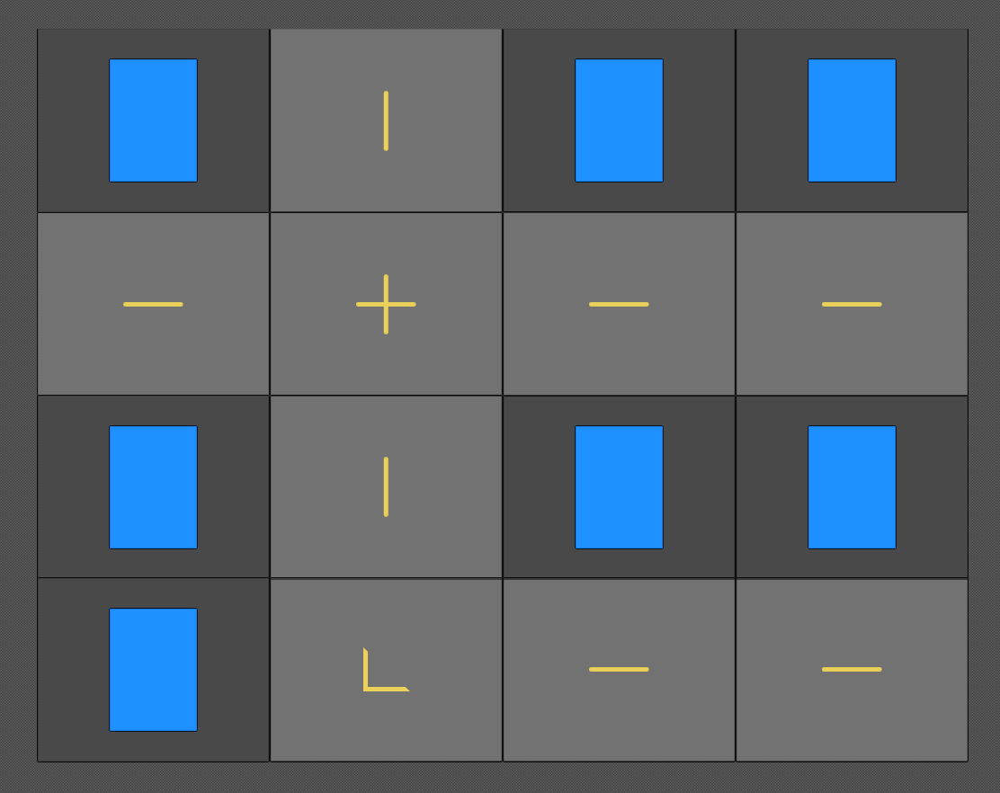
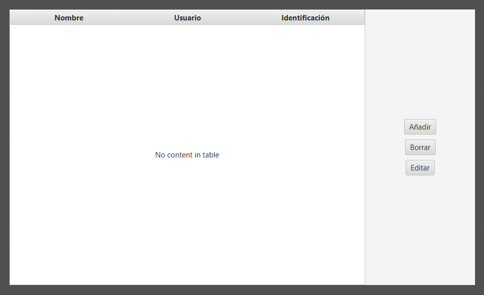
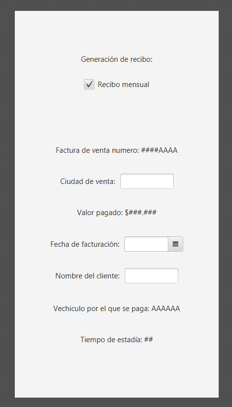
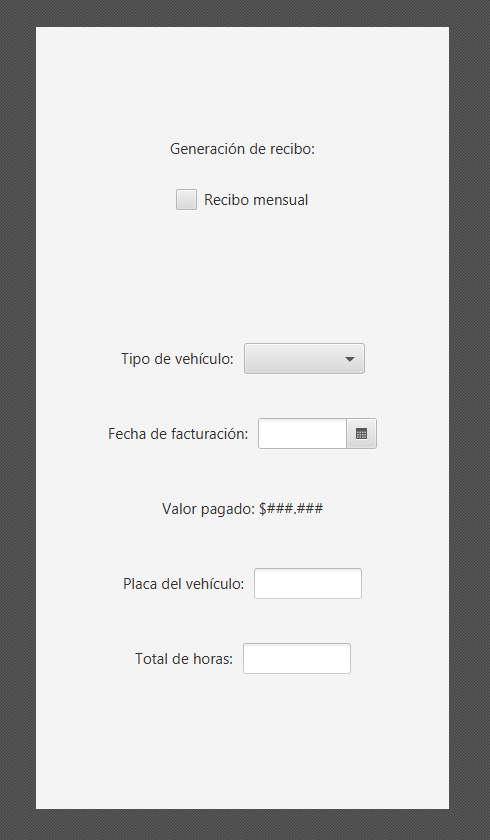
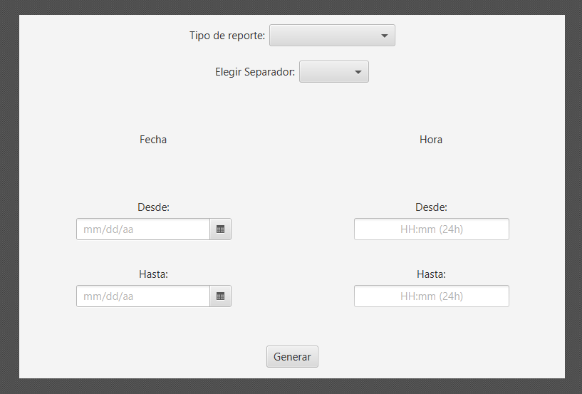

# README: <i>La Ceiba</i> Parking Lot

---
Made by [@1KVueltasAlCampo](https://github.com/1KVueltasAlCampo), [@Juanperezaa](https://github.com/Juanperezaa) and [@zacwastaken](https://github.com/zacwastaken)

<i>This document is part of a Git repository. If you found it elsewhere on the internet, please refer
to [this GitHub repository](https://github.com/zacwastaken/la-ceiba-parking-lot) for the full project.</i>

---

## About

This is a Java app for managing the clients, parking spaces and income of <i>La Ceiba</i> parking
lot.

### [File for the first delivery](docs/FirstDelivery.pdf)

---

## Wireframes 

---

